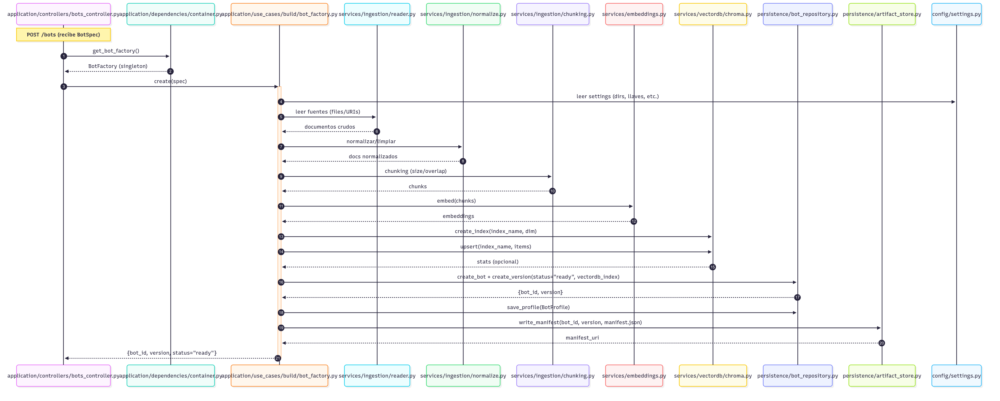
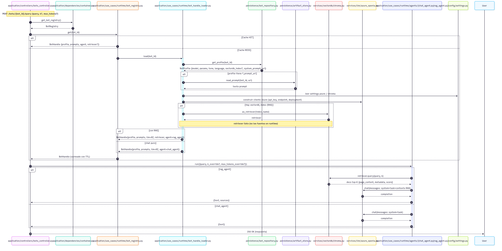
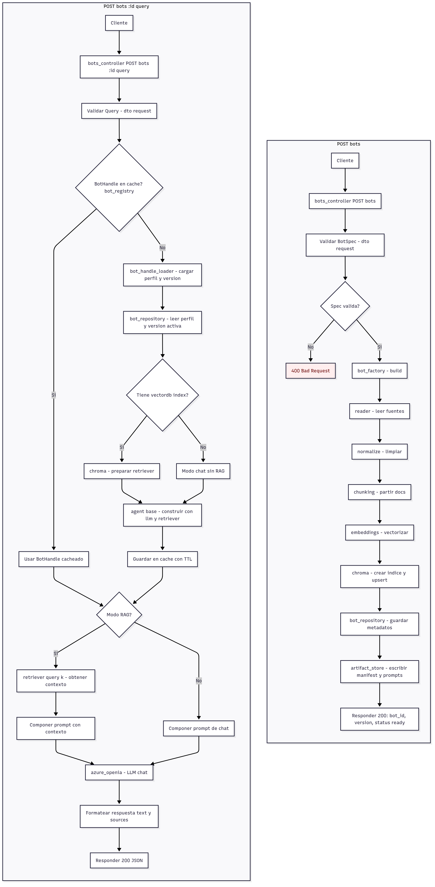

# Bot Maker — Plataforma para crear y ejecutar bots con/sin RAG

Plataforma para **definir un BotSpec**, **construir** un bot (ingesta → normalización → chunking → embeddings → indexado) y **ejecutarlo** vía endpoint `/bots/{id}/query` con caché de handles y modo RAG opcional.

## ✨ Características (MVP)

- **Agnóstico de LLM** mediante providers (OpenAI/Azure/HF local).
- **RAG opcional** con VectorDB (Chroma por defecto).
- **BotSpec** declarativo (YAML/JSON) con validación DTO.
- **Pipeline de construcción** (ingesta → limpieza → chunking → embeddings → upsert).
- **Runtime** con caché por `bot_id` y TTL; modo chat puro o RAG.
- **FastAPI** con OpenAPI y CORS.

---

## 🏗️ Arquitectura de flujos

### 1) Creación del bot (`POST /bots`)


### 2) Consulta del bot (`POST /bots/:id/query`)


### 3) Diagrama de secuencia


---

## 📁 Estructura (sugerida)

```
.
├── README.md
├── bot_creador_de_bots_blueprint_v_1.md
├── requirements.txt
└── src/
    ├── application/
    │   ├── main.py                   # FastAPI app (incluye routers/controllers)
    │   ├── dependencies/
    │   │   └── container.py          # wiring DI / singletons / settings
    │   └── controllers/
    │       └── bots_controller.py    # POST /bots, POST /bots/{id}/query
    ├── config/
    │   └── settings.py               # Pydantic BaseSettings
    ├── domain/
    │   ├── entities.py               # Bot, BotVersion, BotProfile
    │   └── specs/schema.py           # BotSpec DTO/validación
    ├── persistence/
    │   ├── bot_repository.py         # metadatos/versions/estado
    │   └── artifact_store.py         # manifest + prompts
    ├── services/
    │   ├── embeddings.py             # wrapper embeddings (OpenAI/HF)
    │   ├── llm/                      # providers LLM (openai/azure/hf)
    │   ├── vectordb/chroma.py        # create_index, upsert, retriever
    │   ├── ingestion/
    │   │   ├── reader.py             # files/URIs
    │   │   ├── normalize.py          # limpieza/metadata
    │   │   └── chunking.py           # chunk size/overlap
    │   └── runtime/
    │       ├── bot_handle_loader.py  # carga perfil+version
    │       └── bot_registry.py       # caché TTL por bot_id
    └── utils/
        └── logger.py
```

---

## ⚙️ Configuración

### Requisitos
- Python 3.12+
- 

### Instalación
```bash
python -m venv .venv && source .venv/bin/activate  # Windows: .venv\Scripts\activate
pip install -r requirements.txt
```

### Variables de entorno (`.env`)
```env
# FastAPI
APP_ENV=dev
API_HOST=0.0.0.0
API_PORT=8000
CORS_ORIGINS=*

# LLM 
AZURE_OPENAI_API_KEY=

```

> `config/settings.py` debe cargar estas variables con **Pydantic BaseSettings** y exponer un singleton en `dependencies/container.py`.

---

## ▶️ Ejecución

```bash
uvicorn src.application.main:app --host 0.0.0.0 --port 8000 --reload
```
- Docs: `http://localhost:8000/docs`
- Healthcheck recomendado en `main.py` (`GET /health`).

---

## 📜 Esquema de BotSpec (mínimo)

```yaml
bot:
  name: "Mi primer bot"
  language: es
  tone: friendly
  provider:
    llm: openai         # openai|azure|hf
    model: gpt-4o-mini  # o tu modelo local HF
    temperature: 0.2
  rag:
    enabled: true
    k: 6
  datasets:
    - type: files
      files:
        - ./samples/guia.pdf
      chunking:
        size: 800
        overlap: 120
```

> El controlador valida el DTO (Pydantic) y responde `400` si el spec es inválido.

---

## 🧪 Endpoints (ejemplos)

### 1) Crear bot
`POST /bots`

```json
{
  "bot": {
    "name": "FAQ Compañía",
    "language": "es",
    "tone": "neutral",
    "provider": { "llm": "openai", "model": "gpt-4o-mini", "temperature": 0.2 },
    "rag": { "enabled": true, "k": 6 },
    "datasets": [
      {
        "type": "files",
        "files": ["./samples/faq.pdf"],
        "chunking": { "size": 800, "overlap": 120 }
      }
    ]
  }
}
```

**Respuesta 200**
```json
{
  "bot_id": "bot_123",
  "version": "v1",
  "status": "ready"
}
```

### 2) Consultar bot (RAG o chat puro)
`POST /bots/{bot_id}/query`

```json
{
  "query": "¿Cómo solicito soporte técnico?",
  "mode": "rag",
  "max_tokens": 300
}
```

**Respuesta 200**
```json
{
  "text": "Puedes abrir un ticket en ...",
  "sources": [
    {"id":"faq.pdf#p2","score":0.83,"snippet":"Para soporte técnico..."}
  ],
  "usage": {"tokens_in": 122, "tokens_out": 91, "latency_ms": 740}
}
```

---

## 🧩 Componentes clave (MVP)

- **`bot_factory.py`**: orquesta el build (ingesta → normalizar → chunking → embeddings → index → persistencia → artefactos).
- **`bot_repository.py`**: crea/lee metadatos de `bot_id`, `version`, estado y referencias a índices.
- **`artifact_store.py`**: guarda `manifest.json`, prompts y configuración de runtime por versión.
- **`bot_registry.py`**: caché en memoria (TTL) de `BotHandle` para acelerar `/query`.
- **`chroma.py`**: crea índice y expone `as_retriever(k)`; upsert de embeddings.

---
